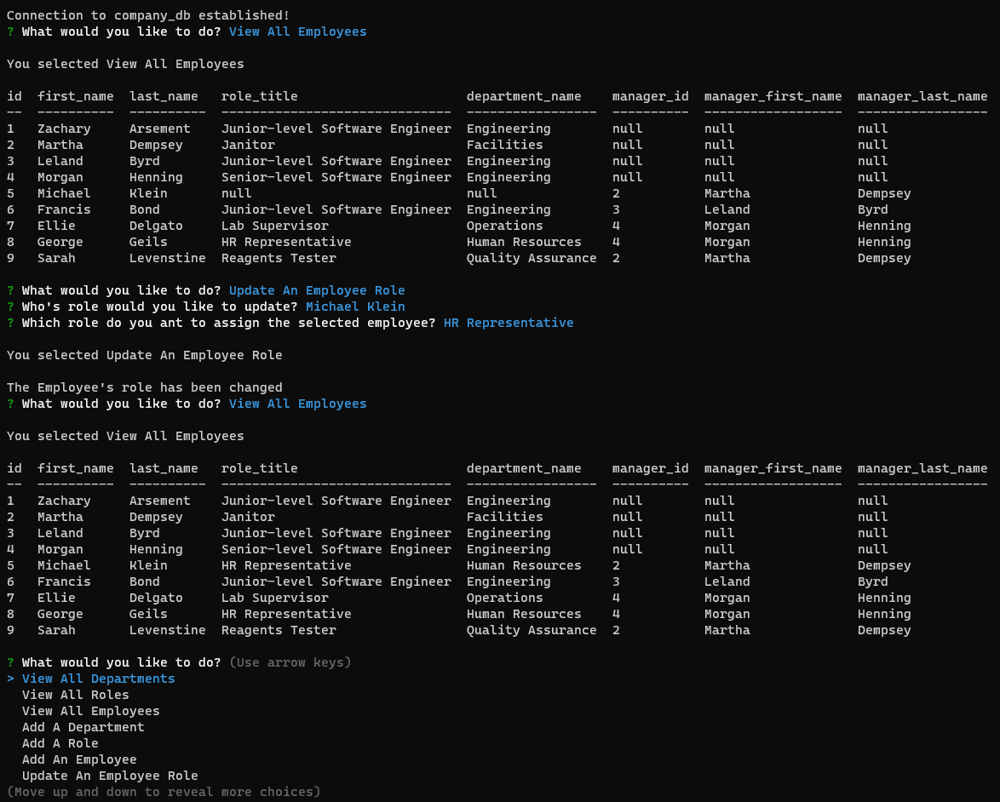

# EMPLOYEE TRACKER
[](https://opensource.org/licenses/MIT)
[](code_of_conduct.md)

## Table of Contents
- [Description](#Description)
- [Links](#Links)
- [Technologies](#Technologies)
- [Screenshot of Application](#Screenshot-of-Application)
- [Installation Instructions](#Installation-Instructions)
- [User Instructions](#User-Instructions)
- [License](#License)
- [Contribution](#Contribution)
- [Acknowledgements](#Acknowledgements)
- [Questions](#Questions)

## Description
**Employee Tracker** is a command-line application that allows for the user to display, update, and manage departments, roles, and employees within a company.  This content management system was builty primarily with [Node.js](https://nodejs.org/en/) , [Inquirer](https://www.npmjs.com/package/inquirer), and [MySQL](https://www.npmjs.com/package/mysql2) packages. **Employee Tracker** was created to provide small businesses owners and HR departments with a platform that allows for them to organize and manage employee, role, and department data within their database.

**Employee Tracker** currently allows the user to perform the following actions...
| Action      | 
| ----------- | 
| Display Departments |
| Display Roles |
| Display Employees | 
| Display Employees By Department |
| Display Budget For Each Department |
| Add Department |
| Add Role | 
| Add Employee |
| Update Employee Role |
| Update Employee Manager |
| Delete Department |
| Delete Role |
| Delete Employee |


## Technologies Used


## Links
- ### [URL to Github Repository](https://github.com/inklein1997/Employee-Tracker)
- ### [URL to Video Walkthrough of Application]()

## Screenshot of Webpage


## Installation Instructions
Since **Employee Tracker** is primarily a NodeJS application, you must have NodeJS downloaded. Please download [here](https://nodejs.org/en/download/) if you have not done so previously.

<br>

To create and seed the database, you must have MySQL installed.  Please download [here](https://www.mysql.com/downloads/) if you have not done so previously.  To create and seed the company_db database, please follow these instructions...
1. Log into MySQL into your command-line while be located in Employee-Tracker's repository.
```
mysql -u root -p
```
2. Once logged in, enter the following commands...
```
SOURCE main/db/schema.sql;
SOURCE main/db/seeds.sql;
```
3. Exit the MySQL CLI by entering the following command...
```
quit
```

<br>

You must install the following packages BEFORE invoking this application by entering the following commands into your command-line.
1. [Inquirer package](https://www.npmjs.com/package/inquirer)
```
npm i inquirer
```

2. [MySQL2 package](https://www.npmjs.com/package/mysql2)
```
npm i mysql2
```

3. [console.table package](https://www.npmjs.com/package/console.table)
```
npm i console.table
```

## User Instructions
1. To invoke this application, please enter the following command into the command-line:
```
node index.js
```
2. The user then selects from the following list of options

| Actions     | |
| ----------- | ----------- | 
| Display Departments | Display Roles |
| Display Employees | Display Employees By Department |
| Display Budget For Each Department | Add Department |
| Add Role | Add Employee |
| Update Employee Role | Update Employee Manager |
| Delete Department | Update Employee Manager |
| Delete Employee | |


If you would like to watch a video runthrough of the application, click [Here]().


## License
This project is licensed under the terms of [MIT](https://opensource.org/licenses/MIT).
  
## Contribution
Before contributing to **Employee-Tracker**, please read this [code of conduct](code_of_conduct.md)[^1].<br>
Here's how you can contribute...
1. Add issue or recommendation for improvement to Issues tab on Github.
2. Submit pull request for review.

## Acknowledgements

## Questions
If you have any questions, please contact me via:
1. GitHub -- [@inklein1997](https://github.com/inklein1997)
2. Email -- michaelklein1997@gmail.com

[^1]: Code of Conduct provided by [Contributor Covenant](https://www.contributor-covenant.org/)